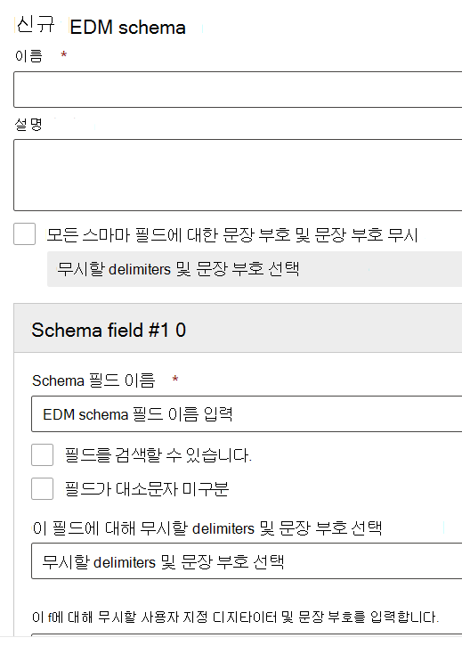

# 정확한 데이터 일치 스키마 및 중요한 정보 유형 마법사 사용

[EDM(정확한 데이터 일치) 기반 분류](create-custom-sensitive-information-types-with-exact-data-match-based-classification.md)를 사용하여 사용자 지정 중요한 정보 유형을 생성하려면 여러 단계를 거쳐야 합니다.  이 마법사를 사용하여 스키마와 중요한 정보 유형 패턴(규칙 패키지) 파일을 만들어 프로세스를 간소화할 수 있습니다.

> [!NOTE]
> 정확한 데이터 일치 스키마 및 중요 정보 유형 마법사는 월드 와이드 및 GCC 클라우드에서만 사용할 수 있습니다.

이 마법사는 다음 대신 사용할 수 있습니다.

- [중요한 정보 데이터베이스의 스키마 정의](create-custom-sensitive-information-types-with-exact-data-match-based-classification.md#define-the-schema-for-your-database-of-sensitive-information)
- [패턴 설정(규칙 패키지)](create-custom-sensitive-information-types-with-exact-data-match-based-classification.md#set-up-a-rule-package)

[1단계: EDM 기반 분류 설정](create-custom-sensitive-information-types-with-exact-data-match-based-classification.md#part-1-set-up-edm-based-classification).

## 필수 구성 요소

1. EDM [ 워크플로 한 눈에 보기](create-custom-sensitive-information-types-with-exact-data-match-based-classification.md#the-work-flow-at-a-glance)를 통해 사용자 지정 중요한 정보 유형을 생성하는 단계를 숙지하세요.

2. [.csv 형식으로 중요한 데이터 저장](create-custom-sensitive-information-types-with-exact-data-match-based-classification.md#save-sensitive-data-in-csv-format) 섹션의 단계를 수행하세요.

## 정확한 데이터 일치 스키마 및 중요한 정보 유형 패턴 마법사 사용

1. 테넌트에 대한 Microsoft 365 규정 준수 센터에서 **데이터 분류** > **일치 데이터 추출** 로 이동하세요.

2. **EDM 스키마 생성** 을 선택하여 스키마 마법사 구성 플라이아웃을 선택합니다.

3. 적절한 **이름** 과 **설명** 을 입력합니다.

4. 해당 동작을 수행하려면 **모든 스키마 필드에 대한 구분 기호 및 구두점 무시** 를 선택합니다. 대/소문자나 구분 기호를 무시하도록 EDM을 구성하는 방법에 대한 자세한 내용은 [EDM(정확한 데이터 일치) 기반 분류를 사용하여 사용자 지정 중요한 정보 유형 생성](create-custom-sensitive-information-types-with-exact-data-match-based-classification.md)을 참조하세요.

5. **Schema 필드 #1** 에 대해 원하는 값을 입력하고 필요에 따라 필드를 추가합니다. 

> [!IMPORTANT]
> 하나 이상의 스키마 필드를 검색 가능으로 지정해야 합니다.

6. 저장을 선택합니다. 스키마가 나열됩니다.

7. **EDM 중요한 정보 유형** 과 **EDM 중요한 정보 유형** 을 선택하고 중요한 정보 유형 구성 마법사를 선택합니다.

8. **기존 EDM 스키마** 를 선택하고 목록에서 2-6단계에서 생성한 스키마를 선택합니다.

9. **다음** 을 선택하고 **패턴 생성** 을 선택합니다.

10. **신뢰 수준** 및 **기본 요소** 를 선택합니다.  패턴을 구성하는 방법에 대한 자세한 내용은 [규정 준수 센터에서 사용자 지정 중요한 정보 유형 생성](create-a-custom-sensitive-information-type.md)을 참조하세요.

11.  연결할 **기본 요소에 대한 중요한 정보 유형** 을 선택합니다. 사용 가능한 중요한 정보 유형에 대한 자세한 내용은 [중요한 정보 유형 엔티티 정의](sensitive-information-type-entity-definitions.md)를 참조하세요.

12. **완료** 를 선택합니다.

13. 원하는 **신뢰 수준 및 문자 근접성** 을 선택합니다.  이 값은 전체 EDM 중요한 정보 유형에 대한 기본값이 됩니다.

13. EDM 중요한 정보 유형에 대한 추가 패턴을 만들려는 경우 **패턴 생성** 을 선택합니다.

14. **다음** 을 선택하고 **이름** 과 **관리자 설명** 을 입력합니다.

15. 검토하고 **제출** 을 선택합니다.

중요한 정보 유형 패턴을 선택하여 편집 및 삭제 컨트롤의 표면을 선택하여 삭제하거나 편집할 수 있습니다.

> [!IMPORTANT]
> 스키마를 제거하려면 해당 스키마가 EDM에 중요한 정보 유형과 이미 연결되어 있는 경우 먼저 EDM에 중요한 정보 유형을 삭제한 후 스키마를 삭제할 수 있습니다.

## 이후 단계

이 마법사를 사용하여 EDM 스키마 및 패턴(규칙 패키지) 파일을 생성한 후에도 [2 단계: 중요 데이터 해시 및 업로드](create-custom-sensitive-information-types-with-exact-data-match-based-classification.md#part-2-hash-and-upload-the-sensitive-data)를 완료해야 EDM 사용자 지정 정보 유형을 사용할 수 있습니다.