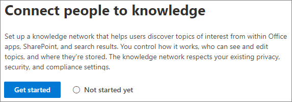
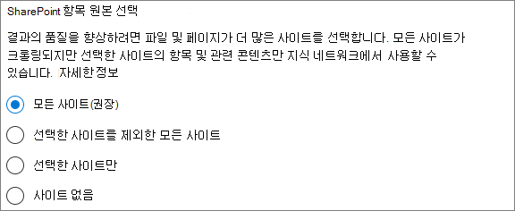
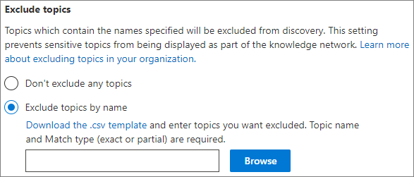
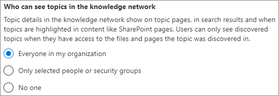
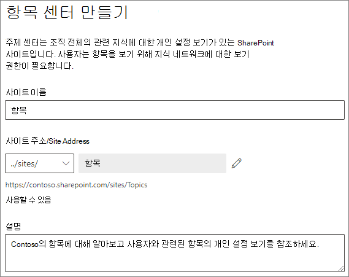
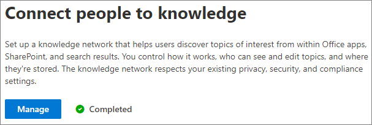

# Microsoft 365에서 항목 환경 설정Set up topic experiences in Microsoft 365

 

> [!VIDEO https://www.microsoft.com/videoplayer/embed/RE4LBp7]  

 

Microsoft 365 관리 센터를 사용하여 항목 환경을 설정하고 [구성할 수 있습니다.](topic-experiences-overview.md)You can use the Microsoft 365 admin center to set up and configure [topic experiences](topic-experiences-overview.md). 

환경에서 항목을 설정하고 구성하는 가장 좋은 방법을 계획하는 것이 중요합니다.It is important to plan the best way to set up and configure topics in your environment. 이 [문서의](plan-topic-experiences.md) 절차를 시작하기 전에 계획 항목 환경을 읽어 보아야 합니다.Be sure to read [Plan topic experiences](plan-topic-experiences.md) before you begin the procedures in this article.

Microsoft 365 관리 센터에 액세스하고 항목 환경을 설정하려면 전역 관리자 또는 SharePoint 관리자 되어야 합니다.You must be a global administrator or SharePoint administrator to access the Microsoft 365 admin center and set up topic experiences.

## 주제 경험 설정Set up topic experiences

Microsoft 365에서 항목 환경을 설정하기 위해To set up topic experiences in Microsoft 365

1. Microsoft [365](https://admin.microsoft.com)관리 센터에서 설치를 **선택하고** 파일 및 콘텐츠 **섹션을** 시청합니다.In the [Microsoft 365 admin center](https://admin.microsoft.com), select **Setup**, and then view the **Files and content** section.
2. 파일 및 **콘텐츠 섹션에서** 사용자와 지식 **연결을 클릭합니다.**In the **Files and content** section, click **Connect people to knowledge**.

     

3. 사용자와 지식 연결 **페이지에서** 시작을 **클릭하여** 설정 프로세스를 진행합니다.On the **Connect people to knowledge** page, click **Get started** to walk you through the setup process.

     

4. 지식 **네트워크에서 항목을** 찾을 수 있는 방법 선택 페이지에서 항목 검색을 구성합니다.On the **Choose how the knowledge network can find topics** page, you will configure topic discovery. SharePoint  항목 원본 선택 섹션에서 검색 중에 항목에 대한 원본으로 크롤링할 SharePoint 사이트를 선택합니다.In the **Select SharePoint topic sources** section, select which SharePoint sites will be crawled as sources for your topics during discovery. 다음 중 선택:Choose from:
    - **모든 사이트**: 조직의 모든 SharePoint 사이트**All sites**: All SharePoint sites in your organization. 여기에는 현재 및 향후 사이트가 포함됩니다.This includes current and future sites.
    - **선택한 사이트를 제외한** 모든 사이트: 제외할 사이트의 이름을 입력합니다.**All, except selected sites**: Type the names of the sites you want to exclude.  검색에서 옵트아웃하려는 사이트 목록을 업로드할 수도 있습니다.You can also upload a list of sites that you want to opt out from discovery. 앞으로 만든 사이트는 항목 검색을 위한 원본으로 포함됩니다.Sites created in future will be included as sources for topic discovery. 
    - **선택한 사이트만**: 포함할 사이트의 이름을 입력합니다.**Only selected sites**: Type the names of the sites you want to include. 사이트 목록을 업로드할 수도 있습니다.You can also upload a list of sites. 앞으로 만든 사이트는 항목 검색을 위한 원본으로 포함되지 않습니다.Sites created in the future will not be included as sources for topic discovery.
    - **사이트 없음**: SharePoint 사이트를 포함하지 않습니다.**No sites**: Do not include any SharePoint sites.

     
   
5. 이름 항목 **제외** 섹션에서 항목 검색에서 제외하려는 항목의 이름을 추가할 수 있습니다.In the **Exclude topics by name** section, you can add names of topics you want to exclude from topic discovery. 이 설정을 사용하여 중요한 정보가 항목으로 포함되지 않도록 합니다.Use this setting to prevent sensitive information from being included as topics. 옵션은 다음과 같습니다.The options are:
    - **항목을 제외하지 않습니다.****Don't exclude any topics** 
    - **이름으로 항목 제외****Exclude topics by name**

     

    (지식 관리자는 검색 후 항목 센터의 항목을 제외할 수 있습니다.)(Knowledge managers can also exclude topics in the topic center after discovery.)

    #### 이름으로 항목을 제외하는 방법How to exclude topics by name    

    항목을 제외해야 하는 경우 이름으로 제외 항목을 선택한 후 .csv 템플릿을 다운로드하여 검색 결과에서 제외하려는 항목 목록으로 업데이트합니다.If you need to exclude topics, after selecting **Exclude topics by name**, select download the .csv template and update it with the list of topics that you want to exclude from your discovery results.

     

    CSV 템플릿에서 제외할 항목에 대한 다음 정보를 입력합니다.In the CSV template, enter the following information about the topics you want to exclude:

    - **이름:** 제외할 항목의 이름을 입력합니다.**Name**: Type the name of the topic you want to exclude. 이 작업은 다음 두 가지 방법으로 수행할 수 있습니다.There are two ways to do this:
        - 정확한 일치: 정확한 이름이나 약어(예: *Contoso* 또는 ATL)를 포함할 *수 있습니다.*Exact match: You can include the exact name or acronym (for example, *Contoso* or *ATL*).
        - 부분 일치: 특정 단어가 있는 모든 항목을 제외할 수 있습니다.Partial match: You can exclude all topics that have a specific word in it.  예를 들어 *호는* 호 원, 마주치기 또는 교육 호와 같이 단어 호가 있는 모든 항목을 *제외합니다.*  아키텍처와 같이 텍스트가 단어의 일부로 포함된 항목은 제외하지 *않습니다.*For example, *arc* will exclude all topics with the word *arc* in it, such as *Arc circle*, *Plasma arc welding*, or *Training arc*. Note that it will not exclude topics in which the text is included as part of a word, such as *Architecture*.
    - **약어(선택 사항)**: 약어를 제외하려는 경우 약어가 대명하는 단어를 입력합니다.**Stands for (optional)**: If you want to exclude an acronym, type the words the acronym stands for.
    - **MatchType-Exact/Partial**: 입력한 이름이 정확히 일치하는 형식인지 부분 일치 *형식인지* *여부를* 입력합니다.**MatchType-Exact/Partial**: Type whether the name you entered was an *exact* or *partial* match type.

    .csv 파일을 완료하고 저장한 후 **찾아보기를** 선택하여 찾습니다.After you've completed and saved your .csv file, select **Browse** to locate and select it.
    
    **다음** 을 선택합니다.Select **Next**.

6. 항목을 **볼 수 있는 사람** 및 해당 항목을 볼 수 있는 위치 페이지에서 항목 표시를 구성합니다.On the **Who can see topics and where can they see them** page, you will configure topic visibility. 지식  네트워크 설정에서 항목을 볼 수 있는 사용자에서 강조 표시된 항목, 항목 카드, 검색의 항목 답변 및 항목 페이지와 같은 항목 세부 정보에 액세스할 수 있는 사용자 선택In the **Who can see topics in the knowledge network** setting, you choose who will have access to topic details, such as highlighted topics, topic cards, topic answers in search, and topic pages. 다음을 선택할 수 있습니다.You can select:
    - **조직의 모든 사용자****Everyone in my organization**
    - **선택한 사용자 또는 보안 그룹만****Only selected people or security groups**
    - **아무도 없어****No one**

      

 > [!Note] 
 > 이 설정을 사용하면 조직의 모든 사용자를 선택할 수 있습니다. 그러나 항목에 항목 환경 라이선스가 할당된 사용자만 항목을 볼 수 있습니다.While this setting allows you to select any user in your organization, only users who have Topic Experiences licenses assigned to them will be able to view topics.

7. 항목 관리에 **대한** 사용 권한 페이지에서 항목을 만들거나 편집하거나 관리할 수 있는 사용자들을 선택합니다.In the **Permissions for topic management** page, you choose who will be able to create, edit, or manage topics. 항목을 **만들고 편집할 수** 있는 사용자 섹션에서 다음을 선택할 수 있습니다.In the **Who can create and edit topics** section, you can select:
    - **조직의 모든 사용자****Everyone in my organization**
    - **선택한 사용자 또는 보안 그룹만****Only selected people or security groups**
    - **아무도 없어****No one**

     

8. 항목을 **관리할 수 있는 사용자 섹션에서** 다음을 선택할 수 있습니다.In the **Who can manage topics** section, you can select:
    - **조직의 모든 사용자****Everyone in my organization**
    - **선택한 사용자 또는 보안 그룹만****Only selected people or security groups**

     

    **다음** 을 선택합니다.Select **Next**.

9. 항목 센터 **만들기 페이지에서** 항목 페이지를 보고 항목을 관리할 수 있는 항목 센터 사이트를 만들 수 있습니다.On the **Create topic center** page, you can create your topic center site in which topic pages can be viewed and topics can be managed. 사이트 이름 **상자에** 항목 센터의 이름을 입력합니다.In the **Site name** box, type a name for your Topic center. 필요한 경우 설명 상자에 간단한 설명을 입력할 **수** 있습니다.You can optionally type a short description in the **Description** box. 

**다음** 을 선택합니다.Select **Next**.

     

10. **검토 및 마침** 페이지에서 선택한 설정을 보고 변경하도록 선택할 수 있습니다.On the **Review and finish** page, you can look at your selected setting and choose to make changes. 원하는 항목을 선택한 경우 **활성화** 를 선택합니다.If you are satisfied with your selections, select **Activate**.

11. 기술 **자료 네트워크** 활성화 페이지가 표시되어 시스템에서 선택한 사이트가 항목에 대한 분석 및 기술 센터 사이트 만들기를 시작하게 됩니다.The **Knowledge network activated** page will display, confirming that the system will now start analyzing your selected sites for topics and creating the Knowledge Center site. **완료** 를 선택합니다.Select **Done**.

12. 기술에 대한 사용자 연결 **페이지로 돌아오게** 됩니다.You'll be returned to your **Connect people to knowledge** page. 이 페이지에서 **관리** 를 선택하여 구성 설정을 변경할 수 있습니다.From this page, you can select **Manage** to make any changes to your configuration settings. 

        

## 라이선스 할당Assign licenses

항목 환경을 구성한 후 항목 환경을 사용할 사용자에게 라이선스를 할당해야 합니다.Once you have configured topic experiences, you must assign licenses for the users who will be using topic experiences. 라이선스가 있는 사용자만 주요 항목, 항목 카드, 항목 페이지, 항목 센터 등의 항목에 대한 정보를 볼 수 있습니다.Only users with a license can see information on topics including highlights, topic cards, topic pages and the topic center. 

라이선스를 할당하려면 다음을 수행합니다.To assign licenses:

1. Microsoft 365 관리 센터의 **사용자** 아래에서 **활성 사용자** 를 클릭합니다.In the Microsoft 365 admin center, under **Users**, click **Active users**.

2. 라이선스를 부여할 사용자를 선택하고 **제품 라이선스 관리** 를 클릭합니다.Select the users that you want to license, and click **Manage product licenses**.

3. **추가 할당** 을 선택합니다.Select **Assign more**.

4. **라이선스에서** 항목 **환경을 선택합니다.**Under **Licenses**, select **Topic Experiences**.

5. 앱에서 **인덱스** 및 항목 환경이 포함된 **Graph Connectors** **검색이** 모두 선택되어 있는지 확인 합니다.Under **Apps**, make sure **Graph Connectors Search with Index** and **Topic Experiences** are both selected.

    > [!div class="mx-imgBorder"]
    > 

6. **변경 사항 저장** 를 클릭합니다.Click **Save changes**.

## 항목 환경 관리Manage topic experiences

항목 환경을 설정한 후 [Microsoft 365](https://admin.microsoft.com/AdminPortal#/featureexplorer/csi/KnowledgeManagement)관리 센터에서 설치 중에 선택한 설정을 변경할 수 있습니다.Once you have set up topic experiences, you can change the settings that you chose during setup in the [Microsoft 365 admin center](https://admin.microsoft.com/AdminPortal#/featureexplorer/csi/KnowledgeManagement). 다음 참조를 참조합니다.See the following references:

- [Microsoft 365에서 항목 검색 관리Manage topic discovery in Microsoft 365](topic-experiences-discovery.md)
- [Microsoft 365에서 항목 표시 관리Manage topic visibility in Microsoft 365](topic-experiences-knowledge-rules.md)
- [Microsoft 365에서 항목 사용 권한 관리Manage topic permissions in Microsoft 365](topic-experiences-user-permissions.md)
- [Microsoft 365에서 항목 센터의 이름 변경Change the name of the topic center in Microsoft 365](topic-experiences-administration.md)

## 참고 항목See also

[항목 환경 개요Topic Experiences Overview](topic-experiences-overview.md)
