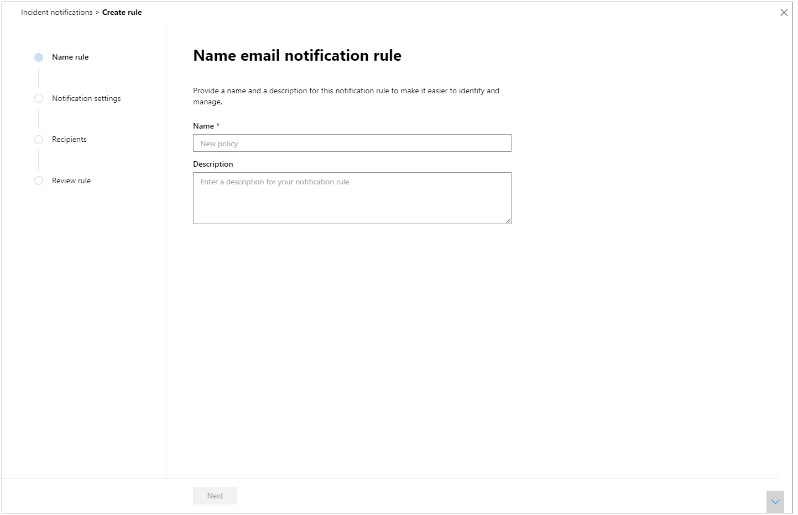
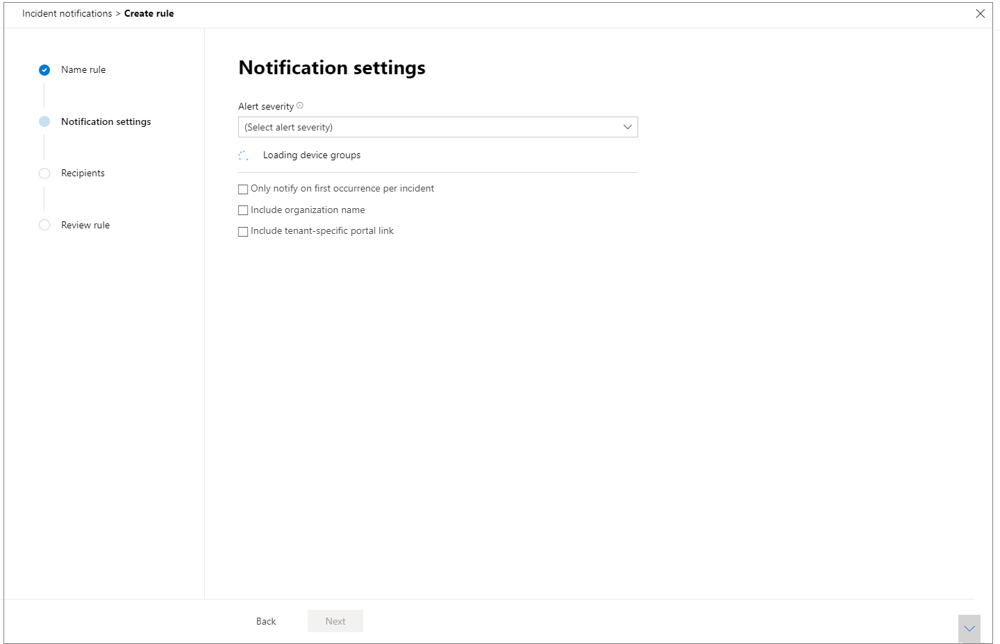
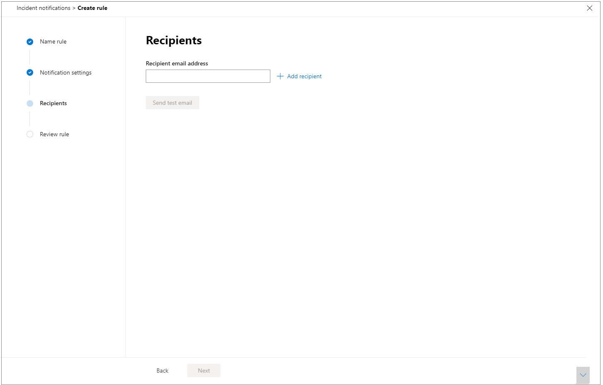

# 전자 메일로 인시던트 알림 확인Get incident notifications by email

[!INCLUDE [Microsoft 365 Defender rebranding](../includes/microsoft-defender.md)]

>[!IMPORTANT]
> 인시던트 기능에 대한 전자 메일 알림은 현재 공개 미리 보기에 있습니다.The email notifications for incidents feature is currently in public preview. 이 기능에 대한 일부 정보는 상업용 가용성 전에 변경될 수 있습니다.Some information about this feature may change before commercial availability. Microsoft makes no warranties, express or implied, with respect to the information provided here.Microsoft makes no warranties, express or implied, with respect to the information provided here.

**적용 대상:****Applies to:**
- Microsoft 365 DefenderMicrosoft 365 Defender

새로운 인시던트 또는 기존 인시던트에 대한 새 업데이트가 있는 경우 전자 메일로 알려도록 Microsoft 365 Defender를 설정할 수 있습니다.You can set up Microsoft 365 Defender to notify you by email every time there are new incidents or new updates to existing incidents. 

인시던트 심각도에 따라 또는 장치 그룹으로 알림을 받을 수 있습니다.You can choose to get notifications based on incident severity or by device group. 인시던트당 첫 번째 업데이트에서만 알림을 하게 선택할 수도 있습니다.You can also choose to get a notification only on the first update per incident.

전자 메일 알림에서 받는 사람을 추가하거나 제거할 수 있습니다.You can add or remove recipients in the email notifications. 새로 추가된 받는 사람은 추가된 후 인시던트에 대한 알림을 받을 수 있습니다.Newly added recipients get notified about incidents after they're added. 

전자 메일 알림에는 인시던트 이름, 심각도, 범주 등 인시던트에 대한 중요한 세부 정보가 포함되어 있습니다.The email notification contains important details about the incident like the incident name, severity, and categories, among others. 또한 인시던트로 바로 이동하여 조사를 바로 시작할 수 있습니다.You can also directly go to incidents so you can start your investigation right away. 인시던트 조사에 대한 자세한 내용은 [Microsoft 365 Defender에서](https://docs.microsoft.com/microsoft-365/security/mtp/investigate-incidents)인시던트 조사를 참조합니다.For more on investigating incidents, see [Investigate incidents in Microsoft 365 Defender](https://docs.microsoft.com/microsoft-365/security/mtp/investigate-incidents).

>[!NOTE]
>전자 메일 알림 설정을 구성하려면 '보안 설정 관리' 권한이 필요합니다.You need 'Manage security settings' permissions to configure email notification settings. 기본 사용 권한 관리를 사용하도록 선택한 경우 보안 관리자 또는 전역 관리자 역할이 있는 사용자가 자동으로 전자 메일 알림을 구성할 수 있습니다.If you've chosen to use basic permissions management, users with Security Administrator or Global Administrator roles can configure email notifications for you.    
마찬가지로 조직에서 RBAC(역할 기반 액세스 제어)를 사용하는 경우 관리할 수 있는 장치 그룹에 따라 알림을 만들고, 편집하고, 삭제하고, 받을 수 있습니다.Likewise, if your organization is using role-based access control (RBAC), you can only create, edit, delete, and receive notifications based on device groups that you are allowed to manage.

## 문제 알림에 대한 규칙 만들기Create rules for incident notifications

인시던트에 대한 첫 번째 전자 메일 알림을 설정하려면 새 규칙을 만들고 전자 메일 알림 설정을 사용자 지정합니다.To set up your first email notification for incidents, create a new rule and customize email notification settings.

1. 탐색 창에서 설정 **인시던트**  >  **전자 메일 알림을 선택합니다.**In the navigation pane, select **Settings** > **Incident email notifications**.
2. 항목 **추가를 선택합니다.**Select **Add item**.
3. 이름에 규칙 이름을 **지정하고 설명을** **입력합니다.**Give the rule a name in **Name** and supply a **Description**.

     
4. **다음을** 선택하여 알림 **설정으로 이동합니다.**Select **Next** to go to **Notification settings**. 여기서 다음을 지정할 수 있습니다.Here you can specify:
    - **경고 심각도** - 인시던트 알림을 트리거하는 경고 심각도 선택**Alert severity** - Choose the alert severity that will trigger an incident notification. 예를 들어 심각도 높은 인시던트에 대한 정보만 원할 경우 높음(High)을 선택합니다.For example, if you only want to be informed about High severity incidents, select High.
    - **장치 그룹 범위** - 이 드롭다운에는 사용자가 액세스할 수 있는 모든 장치 그룹이 표시됩니다.**Device group scope** - This dropdown displays all the device groups the user can access. 인시던트 알림 규칙을 만들 장치 그룹을 선택합니다.Select which device groups you're creating the incident notification rules for.
    - **인시던트당 첫** 번째 발생 시만 알림 - 이 옵션을 선택하면 다른 선택과 일치하는 첫 번째 경고에서만 전자 메일 알림이 전송됩니다.**Only notify on first occurrence per incident** - Selecting this option will send an email notification only on the first alert that matches your other selections. 나중에 인시던트와 관련된 업데이트 또는 알림은 알림을 트리거하지 않습니다.Later updates or alerts related to the incident won't trigger a notification.
    - **조직 이름 포함** - 고객 이름이 전자 메일 알림에 나타나는지 여부를 나타냅니다.**Include organization name** - Indicates whether the customer name appears on the email notification or not.
    - **테넌트별 포털** 링크 포함 - 테넌트 ID가 포함된 링크를 추가하여 특정 테넌트에 대한 액세스를 허용합니다.**Include tenant-specific portal link** -  Adds a link with the tenant ID to allow access to a specific tenant.
    
    
5. 받는 **사람 섹션으로** 이동하려면 **다음을** 선택합니다.Select **Next** to go the **Recipients** section. 여기서 인시던트 전자 메일 알림을 받을 전자 메일 주소를 지정할 수 있습니다.Here you can specify email addresses that will receive the incident email notifications. 모든 **전자 메일 주소를** 입력한 후 받는 사람 추가를 선택합니다.Select **Add a recipient** after typing every email address.

     

6. 마지막으로 새 **규칙과** 연결된  모든 설정을 볼 수 있도록 검토 규칙으로 이동하려면 다음을 선택합니다.Finally, select **Next** to go to **Review rule** so you can see all the settings associated with your new rule. 받는 사람은 설정에 따라 전자 메일을 통해 문제 알림 수신을 시작하게 됩니다.Recipients will start receiving incident notifications through email based on the settings.

## 참고 항목See also
- [Microsoft 365 Defender의 인시던트 개요Incidents overview in Microsoft 365 Defender](https://docs.microsoft.com/microsoft-365/security/mtp/incidents-overview)
- [Microsoft 365 Defender에서 인시던트 우선 순위 지정Prioritize incidents in Microsoft 365 Defender](https://docs.microsoft.com/microsoft-365/security/mtp/incident-queue)
- [Microsoft 365 Defender에서 인시던트 조사Investigate incidents in Microsoft 365 Defender](https://docs.microsoft.com/microsoft-365/security/mtp/investigate-incidents)

